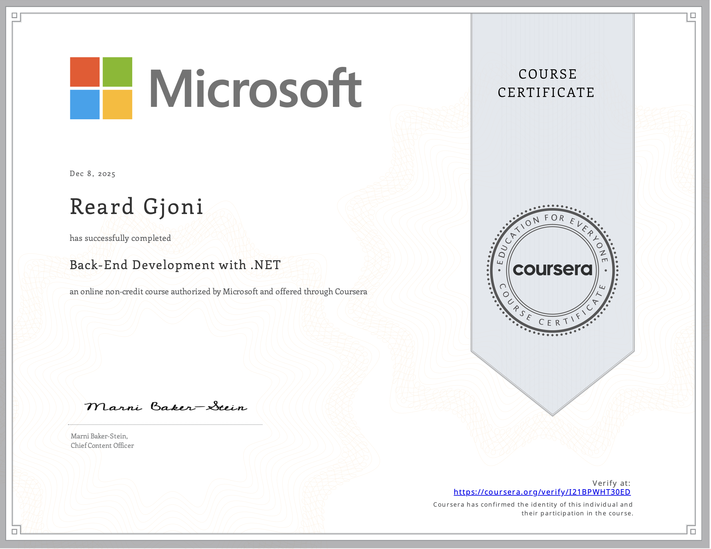
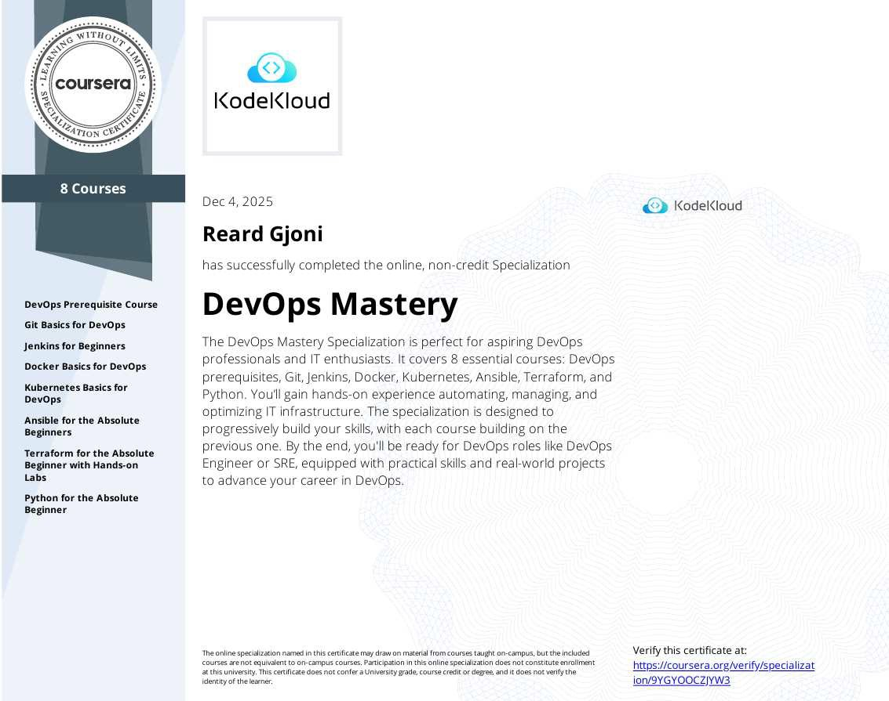
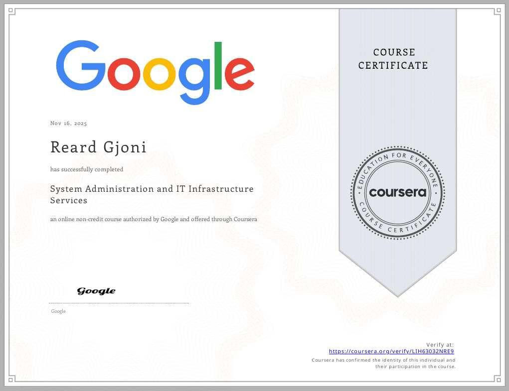
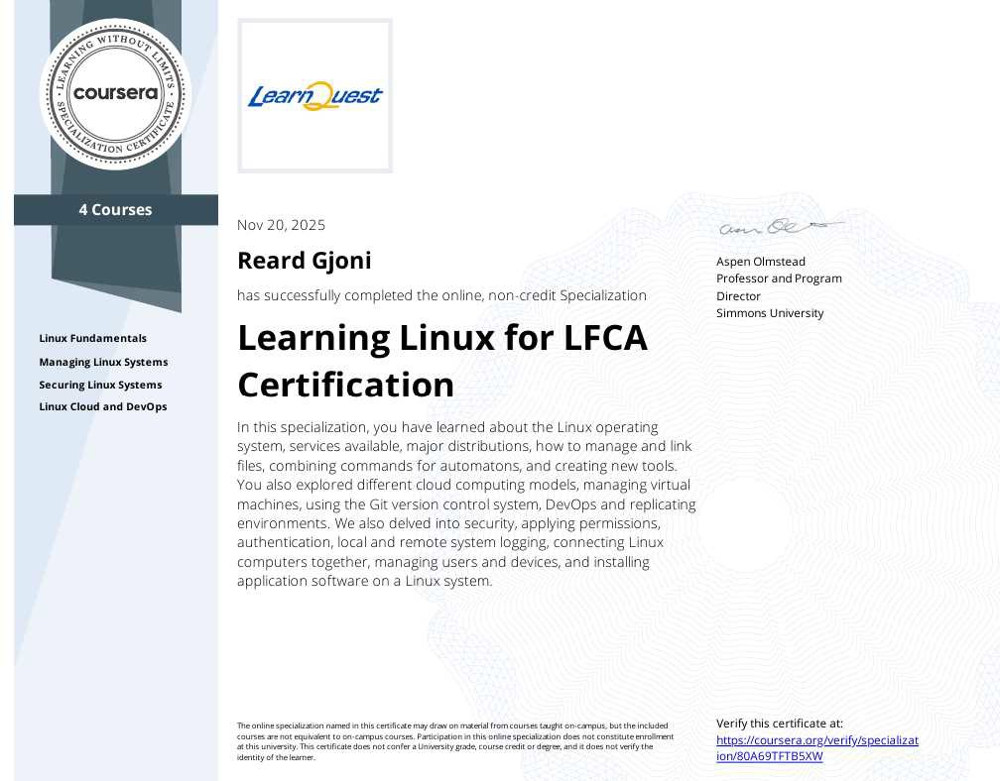
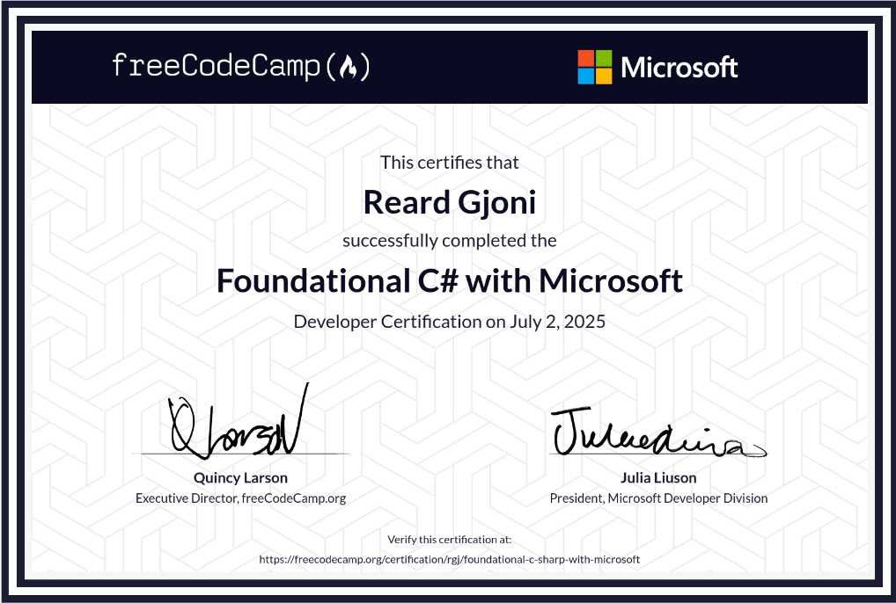
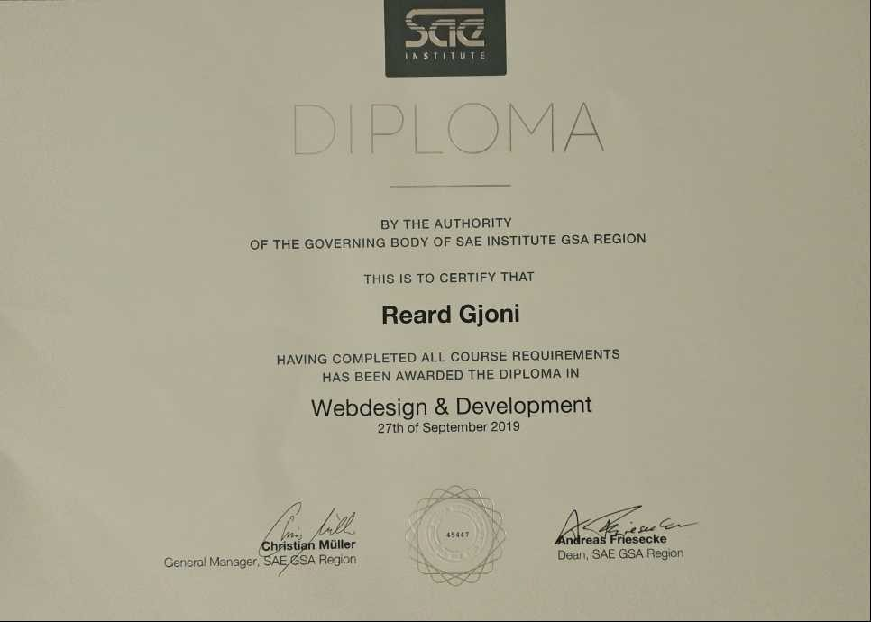
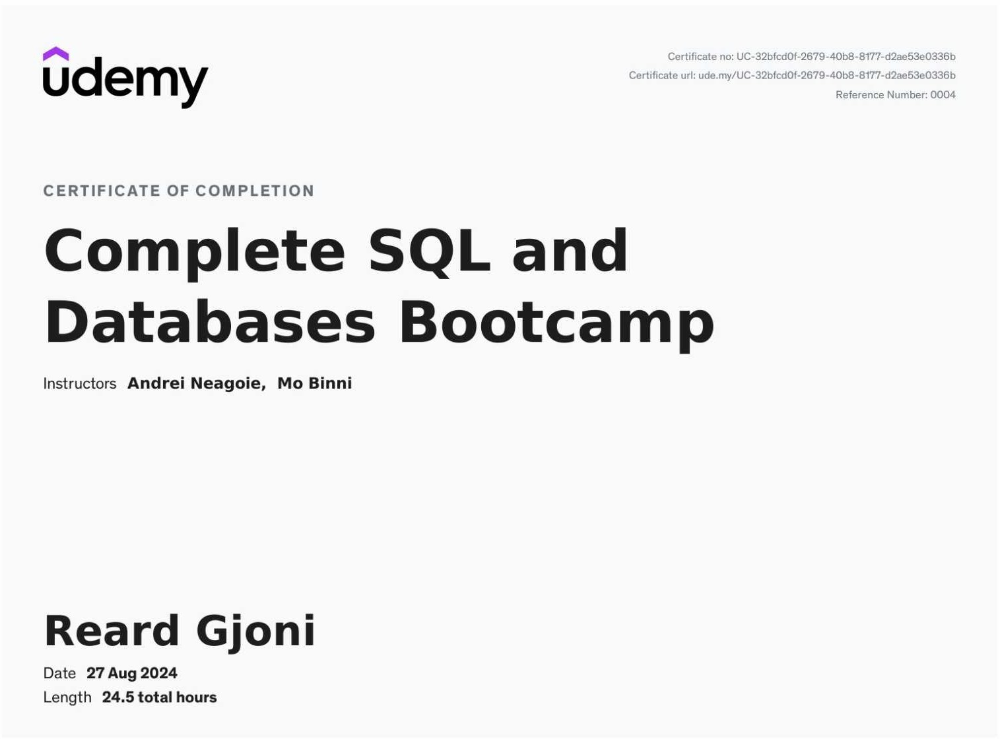
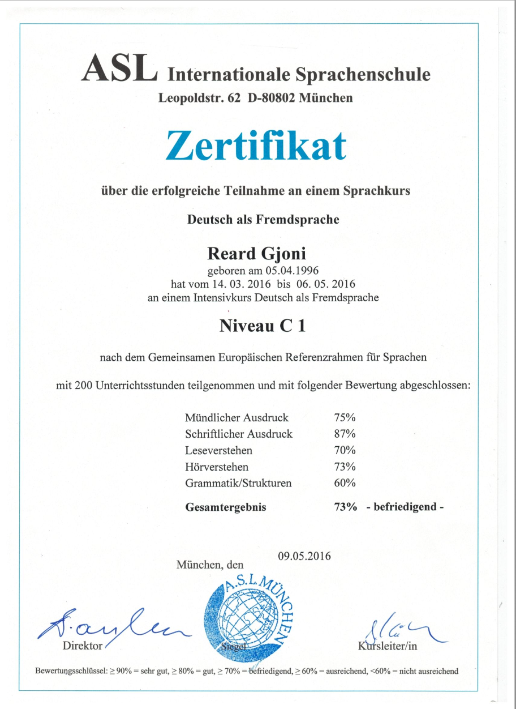

# My certificates

Sat Mar 21 2026 20:00:00 GMT+0100 (Central European Standard Time)

This post shows my certificates or certifications in different areas of technology, be it programming, system administration, cloud or cybersecurity.

[Introduction to Networking on HackTheBox.](https://academy.hackthebox.com/achievement/2507741/34)

